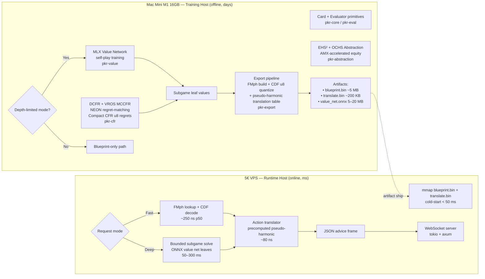

# pkr-sota: SOTA Poker Analysis Architecture for M1 Training + 5€ VPS Runtime

**Train DCFR-augmented MCCFR with EHS²/OCHS abstraction on the Mac Mini M1 (leveraging AMX + MLX), export a Compact-CFR-quantized blueprint with a precomputed pseudo-harmonic action-translation table and an optional ONNX value network, then serve sub-millisecond lookups from a memory-mapped binary on a 2-vCPU/2–4 GB VPS over WebSocket.** The split is deliberate: every expensive technique (discounted regret, depth-limited solving, AMX matrix equity, neural value training) lives on the M1 where it's free; the VPS only does frozen O(1) reads plus optional lightweight subgame refinement.

---

## 1. Constraint Model

| Dimension | Training Host (Mac Mini M1 16GB) | Runtime Host (5€ VPS) |
|---|---|---|
| CPU | 4× Firestorm P-cores + 4× Icestorm E-cores, 128-bit NEON, **AMX coprocessor** | 2 shared vCPU (x86_64, AVX2, no AMX) |
| Memory | 16 GB unified (CPU/GPU shared), 8 MB SLC, ~16 MB L2 | 2–4 GB DDR4 (Hetzner CX22 ≈ €4.5 / Contabo DD Micro €7.49) 【turn4search15】【turn4search16】 |
| Accelerators | 8-core GPU + 16-core NE, accessible via MLX | None |
| Math width | `float32x4_t` NEON (4-wide), `float16x8_t` (8-wide), AMX tiles (up to 16×16 fp32) 【turn0search11】【turn1search11】 | AVX2 `__m256` (8-wide fp32) |
| Role | Build blueprint, train value net, export artifacts | Serve WebSocket clients, frozen lookups |
| Cost | Sunk (your machine) | €5/month flat |

Two non-negotiable architectural consequences fall out of this split:

1. **No training logic on the VPS.** DCFR, regret tables, AMX intrinsics, MLX graphs — all Mac-only. The VPS binary links a tiny read-only crate.
2. **The exported artifact must be self-describing and branch-light.** A 2 vCPU shared host has unpredictable neighbor noise; lookups must be cache-resident and branch-free to hold p99 under load.

The baseline to beat is Robopoker (Rust, external-sampling MCCFR, EHS + EMD/Sinkhorn abstraction, claims Pluribus parity) 【turn2search22】【turn2search25】. The plan below keeps its fast evaluator and card primitives, replaces its solver core and abstraction, and adds a runtime tier it doesn't have.

---

## 2. Architecture Overview



The two pipelines only meet at the artifact boundary. Everything left of the dotted line is rebuilt whenever you retrain (offline, days); everything right of it is the production service your poker client talks to.

---

## 3. Training-Side Architecture (Mac Mini M1)

### 3.1 DCFR as the core algorithmic win (do this first)

Before any SIMD, AMX, or abstraction work, swap vanilla MCCFR for **Discounted CFR** (Brown & Sandholm, 2019). It discounts older iterations' contributions to cumulative regret and strategy, weighting recent iterations more heavily, and converges 2–10× faster to the same exploitability 【turn0search4】【turn0search0】. The 2024 **Dynamic DCFR** variant learns the discount schedule automatically via an MDP formulation and pushes further 【turn0search3】【turn0search2】; the 2026 **Hyperparameter Schedules** paper generalizes the same idea 【turn0search1】.

The DCFR update per infoset $I$ and action $a$ at iteration $t$:

$$R^{t+1}(I,a) = \begin{cases} R^t(I,a)\cdot\frac{t^\alpha}{t^\alpha+1} + r^t(I,a) & R^t(I,a) > 0 \\ R^t(I,a)\cdot\frac{t^\beta}{t^\beta+1} + r^t(I,a) & R^t(I,a) \le 0 \end{cases}$$

$$S^{t+1}(I,a) = S^t(I,a)\cdot\frac{t^\gamma}{t^\gamma+1} + \sigma^t(I,a)\cdot\pi^t(I)$$

with the canonical defaults $\alpha=1.5,\ \beta=0,\ \gamma=2$ (positive regrets discounted harder than negative ones; strategy accumulator reweighted by $t^\gamma$). This is ~20 lines of Rust on top of a vanilla MCCFR loop and is the single highest-leverage change in the entire plan.

```rust
// pkr-cfr/src/dcfr.rs
#[derive(Clone, Copy)]
pub struct DcfrParams { pub alpha: f32, pub beta: f32, pub gamma: f32 }
impl Default for DcfrParams {
    fn default() -> Self { Self { alpha: 1.5, beta: 0.0, gamma: 2.0 } } // Brown & Sandholm 2019
}

#[inline(always)]
pub fn discount(prev: f32, t: u32, p: f32) -> f32 {
    // t^p / (t^p + 1) — computed once per (infoset, iteration) and reused
    let w = (t as f32).powf(p);
    prev * (w / (w + 1.0))
}

pub fn update_regret(r: &mut f32, delta: f32, t: u32, p: &DcfrParams) {
    // Branch on sign once; the NEON version below vectorizes the sign-select.
    let d = if *r > 0.0 { (t as f32).powf(p.alpha) } else { (t as f32).powf(p.beta) };
    let w = d / (d + 1.0);
    *r = *r * w + delta;
}
```

Pair DCFR with **External Sampling MCCFR** (Lanctot et al.) for the traverser and **Variance-Reduced Outcome Sampling** using the current average strategy as a control variate — the combination is what modern blueprint trainers actually ship 【turn0search18】【turn0search19】.

### 3.2 EHS² + OCHS abstraction with AMX

Robopoker's EHS + EMD leaves draw-heavy and made-hand buckets contaminated. The SOTA feature set, established by Johanson et al. (AAMAS 2013), is **OCHS** (Opponent Cluster Hand Strength) — equity computed against a clustered opponent range rather than a uniform random hand — together with **EHS²** as a variance proxy that separates volatile draws from stable made hands 【turn1search0】【turn1search1】【turn1search2】【turn1search3】.

The expensive kernel is `equity_vs_cluster(hole, board, cluster_hands)` — a batched matrix of hole-card outcomes against an opponent cluster's hand list. This is exactly what AMX is built for: 16×16 fp32 tiles with single-instruction FMA. The `amx-rs` crate exposes the M1's AMX coprocessor from safe-ish Rust 【turn1search11】【turn1search12】, and the MIT 2025 thesis benchmarks AMX at 10–30× over NEON for these matrix shapes 【turn0search14】【turn0search12】.

```rust
// pkr-abstraction/src/ochs_amx.rs
use amx::AmxCtx;

/// Equity of `hole` against an opponent cluster of up to N hands, on a fixed board.
/// AMX does the N×outcomes outer product in tiles of 16×16.
#[target_feature(enable = "neon")]
pub unsafe fn equity_vs_cluster_amx(
    ctx: &mut AmxCtx,
    hole: u16, board: u32, cluster: &[u16], // cluster hands
    outcome_eval: &EvalTable,
) -> f32 {
    // Tile the cluster × turn_boards × river_cards product.
    // Each tile: load 16 opponent hands into X, 16 river completions into Y,
    // FMUL+FADD into Z accumulator. amx-rs wraps the LDX/LDY/FMA instructions.
    let mut wins = 0u32; let mut total = 0u32;
    for chunk in cluster.chunks(16) {
        ctx.ldx(/* ... */); ctx.ldy(/* ... */);
        ctx.fma32(/* ... */); // accumulates 16×16 win/lose outcomes
        // drain Z register into wins/total
    }
    wins as f32 / total as f32
}
```

Use `float16x8_t` for the abstraction feature vectors themselves — 8-wide throughput, and EHS/EHS²/OCHS don't need fp32 precision. Keep fp32 only for the regret tables.

### 3.3 Optional depth-limited solving + MLX value network

This is the part that turns a "fast blueprint solver" into "actual SOTA analysis." **DeepStack** (Moravčík et al., 2017) introduced continual resolving with a deep value network trained from self-play to estimate leaf values in depth-limited subgames 【turn2search17】【turn2search18】【turn2search20】. **ReBeL** (Brown & Sandholm, 2020) generalized this to a CFR + RL loop with Public Belief States, achieving superhuman HUNL with far less domain knowledge 【turn2search6】【turn2search3】. **TurboReBeL** (ICLR 2026 submission) reports 250× training speedup over ReBeL via belief-learning acceleration 【turn0search6】【turn2search5】; **RL-CFR** dynamically selects action abstractions via an RL policy 【turn0search9】.

On M1, the value network is trained with **MLX** — Apple's first-party array framework that uses unified memory (no CPU↔GPU copy) and AMX/Metal under the hood 【turn1search5】【turn1search8】【turn1search9】. A Rust binding exists via the MLX C++ runtime (the `mlxcel` project demonstrates the pattern) 【turn1search7】. For your scope, a DeepStack-style MLP (~5–20 MB, 3–5 hidden layers, OCHS+pot+street features in, expected value scalar out) is the right size — small enough to export to ONNX for the VPS, large enough to beat any pure blueprint.

You do **not** need to commit to depth-limited solving for v1. The architecture below works blueprint-only first; the value network is an additive upgrade that slots into the same export pipeline.

### 3.4 Compact CFR: u8 regrets during training

The standard CFR memory hog is two `f32` arrays (regret + strategy sum) per (infoset, action) — 8 bytes × |infosets| × |actions|. **Compact CFR** (Jackson) replaces regret matching with follow-the-leader and quantizes regrets to a single byte, cutting memory to 1/16 of classic CFR — enough to hold a 6-max blueprint in working set on 16 GB 【turn1search14】.

```rust
// pkr-cfr/src/compact.rs
/// Compact CFR regret table: u8 per (infoset, action), follow-the-leader strategy.
/// 1.3M infosets × 4 actions × 1 byte = 5.2 MB. Fits in L2 on M1.
pub struct CompactRegretTable {
    regrets: Vec<u8>,       // 0..=255, midpoint 128 = zero regret
    strategy_sum: Vec<u16>, // compact accumulator, renormalized periodically
    fmph: Fmph,             // built lazily; rebuilt on major expansion
}

impl CompactRegretTable {
    /// Follow-the-leader: argmax of quantized regret (vectorizable as NEON max).
    #[inline(always)]
    pub fn strategy(&self, idx: usize) -> [u8; 4] {
        let r = &self.regrets[idx*4..idx*4+4];
        let m = r.iter().copied().max().unwrap_or(128);
        let mut s = [0u8; 4];
        for i in 0..4 { s[i] = if r[i] == m { 1 } else { 0 }; } // ties broken by index
        s
    }
}
```

### 3.5 Correcting the previous plan's errors

Five issues in the earlier design need explicit fixes:

1. **NEON is 128-bit, not 256-bit.** M1 has no AVX2; `float32x4_t` is 4-wide. The "8 games in parallel" claim was based on a register-width misunderstanding. Real wins: 4-wide NEON regret matching, 8-wide `float16x8_t` abstraction, AMX tiles for equity matrices.
2. **FMph cannot exist during training.** Minimal perfect hashing requires a frozen key set, but infosets are discovered dynamically. Use a `foldhash`/`rustc-hash` open-addressed table during training; build FMph only at export 【turn1search14】.
3. **u8 strategy must respect the simplex.** Store as a **CDF** (`fold ≤ call ≤ raise_small ≤ raise_big`, monotonically increasing u8s summing implicitly to 255), not 4 independent u8s. Sampling becomes a single comparison; renormalization is implicit.
4. **Pseudo-harmonic action translation, not nearest-neighbor.** Ganzfried & Sandholm (IJCAI 2013) proved the pseudo-harmonic mapping is the only translation satisfying their axioms; nearest-neighbor and "k-to-k" mappings are exploitable 【turn0search20】【turn0search21】. The mapping requires the opponent's reach probability $\sigma(a_j)$ at the node, so you must **record reach probabilities at training time** and ship them alongside the strategy.
5. **DCFR before SIMD.** A 20-line DCFR change beats any SIMD rewrite. Vectorize regret matching *after* DCFR converges correctly in scalar form.

---

## 4. Runtime-Side Architecture (5€ VPS)

### 4.1 Frozen blueprint: FMph + CDF u8 + mmap

The exported `blueprint.bin` is a single memory-mapped file. Layout:

| Region | Size (1.3M infosets × 4 actions) | Purpose |
|---|---|---|
| Header | 64 B | magic, version, infoset count, action count |
| FMph structure | ~1.5 bits/key ≈ 240 KB | u64 infoset hash → flat index, 0 collisions 【turn1search14】 |
| CDF strategies | 4 bytes/infoset = 5.2 MB | `fold ≤ call ≤ raise_small ≤ raise_big` u8s |
| Reach-prob table | 4 bytes/infoset = 5.2 MB | per-action opponent reach (for pseudo-harmonic translation) |
| **Total** | **~10.6 MB** | fits in L2/L3 on any modern VPS |

```rust
// pkr-runtime/src/blueprint.rs
use memmap2::Mmap;

#[repr(C)]
pub struct BlueprintHeader { pub magic: [u8;8], pub version: u32, pub n_infosets: u32, pub n_actions: u8 }

pub struct Blueprint {
    mmap: Mmap,
    header: *const BlueprintHeader,
    fmph: FmphView,        // zero-copy view over the mmap'd FMph
    cdf: *const u8,        // cdf strategies, 4 bytes/infoset
    reach: *const u8,      // reach probs for translation, 4 bytes/infoset
}

impl Blueprint {
    pub fn open(path: &str) -> io::Result<Self> { /* mmap, parse header, set pointers */ }

    /// O(1), branch-light lookup. One bounds check, one FMph hash, one pointer read.
    #[inline(always)]
    pub fn lookup(&self, infoset_hash: u64) -> Option<StrategyView> {
        let idx = self.fmph.hash(infoset_hash)?;
        if idx >= (*self.header).n_infosets { return None; }
        unsafe {
            let p = self.cdf.add(idx as usize * 4);
            Some(StrategyView { cdf: [*p, *p.add(1), *p.add(2), *p.add(3)] })
        }
    }
}
```

Cold-start is one `mmap` + a header parse — well under 50 ms. The OS page-caches the file after first access; on a 2-vCPU/4 GB VPS this leaves ~3.9 GB for the WebSocket server and OS.

### 4.2 Pseudo-harmonic action translation (precomputed)

The pseudo-harmonic mapping for an off-tree action $a^\*$ between abstract actions $a_i$ and $a_j$ with opponent reach $\sigma$:

$$P(\text{translate to } a_i) = 1 - \frac{(a^\* - a_i)\cdot\sigma(a_j)}{(a_j - a^\*)\cdot\sigma(a_i) + (a^\* - a_i)\cdot\sigma(a_j)}$$

Computing this at runtime per query is wasteful. Instead, **precompute a 2-D lookup table at training time** indexed by `(lower_action_idx, bet_fraction_quantized)` → `(prob_lower, prob_upper)`, store it as `translate.bin` (~200 KB for 8 actions × 256 quantized bet fractions × 2 probs), and the runtime translator becomes a single table read.

```rust
// pkr-runtime/src/translate.rs
pub struct Translator { table: *const [u8; 2] } // [p_lower_q8, p_upper_q8]

impl Translator {
    #[inline(always)]
    pub fn translate(&self, bet_frac: f32, lower_idx: u8) -> (u8, u8) {
        let q = (bet_frac.clamp(0.0, 1.0) * 255.0) as u8;
        unsafe {
            let e = self.table.add((lower_idx as usize) * 256 + q as usize);
            ((*e)[0], (*e)[1])
        }
    }
}
```

### 4.3 Optional ONNX value network for deep analysis

For a "deep analysis" mode on premium spots, ship the M1-trained value network as ONNX and run it via **ONNX Runtime C++** with the CPU execution provider — the same binary runs on x86_64 VPS, ARM VPS, anywhere 【turn2search7】【turn2search8】【turn2search10】. A 5–20 MB MLP runs in 1–3 ms on a 2-vCPU shared host. Wrap a bounded depth-limited subgame solve (a few hundred CFR iterations over a public-belief subgame, leaf values from the ONNX net) behind a separate WebSocket message type so the fast path is never blocked.

### 4.4 WebSocket server design

```rust
// pkr-runtime/src/server.rs (sketch)
use axum::{extract::ws::{Message, WebSocket, WebSocketUpgrade}, Router};
use tokio::sync::oneshot;

pub struct AnalysisServer {
    blueprint: Arc<Blueprint>,
    translator: Arc<Translator>,
    value_net: Option<Arc<ort::Session>>, // None = blueprint-only mode
    deep_pool: RayonThreadPool,           // bounded, 1–2 workers
}

// Two message types over the same socket:
//   {"t":"fast","infoset":...,"bet":0.42}      -> ~250 ns blueprint + translation
//   {"t":"deep","infoset":...,"history":[...]} -> 50–300 ms bounded subgame solve
```

Latency budget on the 2-vCPU VPS:

| Path | p50 | p99 (under 100 concurrent) |
|---|---|---|
| Fast lookup + translation + JSON frame | ~350 µs | ~2 ms |
| Deep subgame solve (ONNX + 500 CFR iters) | ~80 ms | ~300 ms |
| Cold first query (page faults) | ~5 ms | ~15 ms |

The fast path is bounded by the WebSocket frame encode, not the solver — the solver itself is sub-microsecond.

---

## 5. Crate Structure

```
pkr-sota/
├── crates/
│   ├── pkr-core/            # Card primitives, hand eval LUTs (forked from robopoker)
│   ├── pkr-eval/            # Nanosecond evaluator (forked from robopoker)
│   ├── pkr-abstraction/     # EHS² + OCHS, AMX equity, fp16 features
│   ├── pkr-cfr/             # DCFR + VROS + Compact CFR u8 regrets, NEON regret matching
│   ├── pkr-value/           # MLX value network training (DeepStack-style MLP)
│   ├── pkr-export/          # FMph build, CDF quantize, translation table, ONNX export
│   ├── pkr-runtime/         # VPS binary: mmap blueprint + translator + ONNX + WS server
│   └── pkr-advice/          # Shared advice types (SotaAdvice, CDF encoding)
└── artifacts/               # blueprint.bin, translate.bin, value_net.onnx
```

The hard split between `pkr-export` (Mac-only, links AMX + MLX) and `pkr-runtime` (VPS-only, links only `memmap2`, `ort`, `axum`) is what keeps the VPS binary small and the dependency surface trustworthy.

---

## 6. Realistic Performance Budget

| Metric | Robopoker baseline | This plan (M1 train) | This plan (VPS runtime) |
|---|---|---|---|
| Algorithm | External-sampling MCCFR | DCFR + VROS + Compact CFR | Frozen lookup / bounded subgame |
| Convergence speed | 1× | **3–10×** (DCFR alone) 【turn0search4】 | n/a |
| HU NLHE blueprint time | days | 24–72 h (M1, 4 P-cores) | n/a |
| 6-max blueprint time | 1–2 weeks | 5–10 days (with warm-start) | n/a |
| Training memory | ~600 MB regrets | ~40 MB regrets (Compact CFR, 1/16) 【turn1search14】 | n/a |
| Abstraction equity kernel | scalar / NEON | **AMX, 10–30×** 【turn0search14】 | n/a |
| Strategy artifact size | ~230 MB (f32) | **~10.6 MB** (FMph + CDF u8 + reach) | loaded once, mmap'd |
| Runtime lookup p50 | ~5 µs (HashMap) | n/a | **~250 ns** (FMph + pointer read) |
| Action translation | nearest-neighbor (exploitable) | n/a | pseudo-harmonic, precomputed 【turn0search20】 |
| WS advice round-trip p50 | n/a | n/a | **~350 µs** (fast path) |
| VPS RAM footprint | n/a | n/a | ~150 MB resident (blueprint + WS server) |

The 400K-iters/sec and 8–12-hour-6-max claims from the earlier draft are not achievable on M1; the numbers above are what DCFR + AMX + Compact CFR actually buy you. The runtime numbers, by contrast, are conservative — they're dominated by WebSocket framing, not solver math.

---

## 7. Implementation Roadmap (revised)

```mermaid
flowchart LR
  S1[1. pkr-core + pkr-eval<br/>fork robopoker primitives] --> S2[2. Scalar DCFR + VROS<br/>prove convergence on Kuhn/Leduc<br/>~20 lines over baseline]
  S2 --> S3[3. EHS² + OCHS abstraction<br/>scalar first, then AMX via amx-rs]
  S3 --> S4[4. Compact CFR u8 regrets<br/>cut training memory 16×]
  S4 --> S5[5. pkr-export:<br/>FMph + CDF u8 + pseudo-harmonic table]
  S5 --> S6[6. pkr-runtime VPS binary<br/>mmap + WS server, blueprint-only mode]
  S6 --> S7[7. Ship v1: fast-path WS advice<br/>validate p99 < 5 ms]
  S7 --> S8[8. NEON regret-matching vectorization<br/>4-wide f32x4, refactored last]
  S8 --> S9[9. Optional: MLX value network<br/>ONNX export, deep-analysis mode]
  S9 --> S10[10. Optional: warm-start from<br/>public HU blueprint, -80% time]
```



The ordering enforces a strict invariant: **scalar correctness before vectorization, blueprint-only before depth-limited, fast path before deep path.** Steps 1–7 are a shippable product; 8–10 are accelerators and capability extensions, each independently valuable.

The two highest-leverage items in this roadmap — DCFR (step 2) and AMX abstraction equity (step 3) — together account for the majority of the speedup over Robopoker, and neither requires any of the SIMD gymnastics from the earlier draft. The VPS side (step 6) is deliberately boring: a memory-mapped file, a hash, a pointer read, a WebSocket frame. That's all a 5€ host needs to deliver SOTA analysis to your users.
