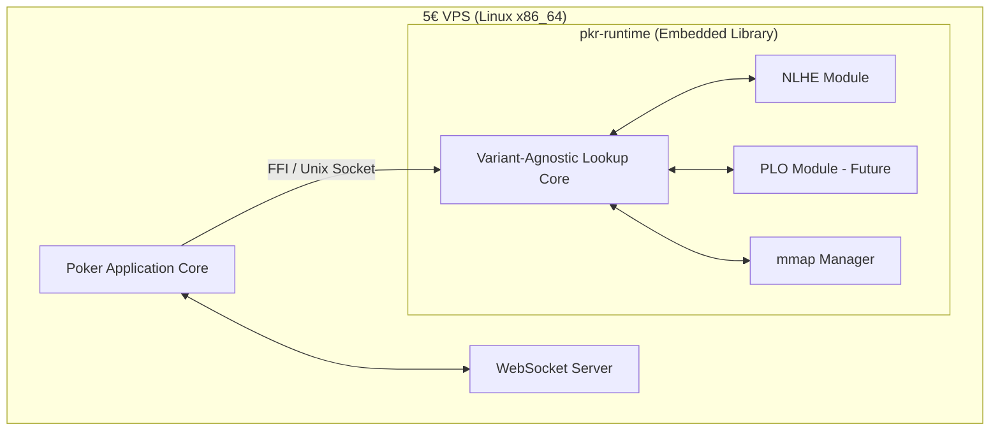
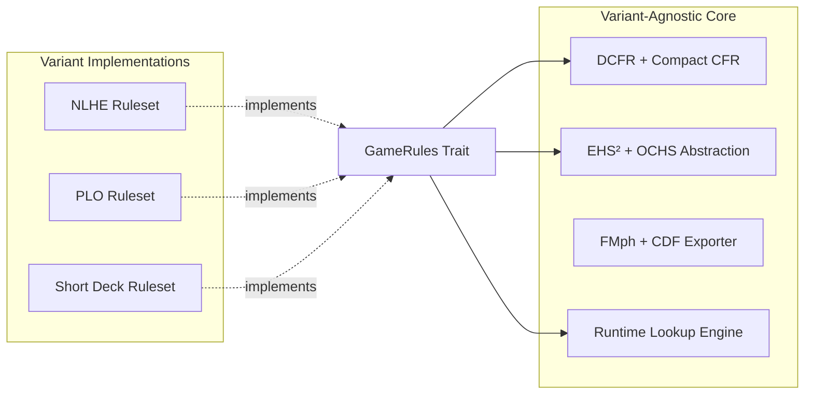
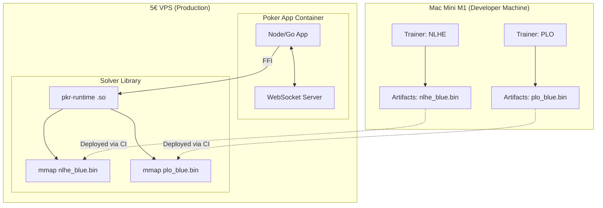

# Architecture & Design Specification — pkr-sota

| Field | Value |
|-------|-------|
| **Project** | pkr-sota |
| **Document** | Architecture & Design Specification (Level 3) |
| **Version** | 1.1 |
| **Date** | 2025-04-21 |
| **Author** | Lead Architect (assisted by AI) |
| **Status** | Accepted |

---

## 1. Context & Scope

### 1.1 Objective
Design a state-of-the-art (SOTA) poker analysis engine that splits computation across two starkly different environments: a Mac Mini M1 16GB (training) and a 5€ VPS (runtime inference). The runtime engine must integrate directly into an existing poker application and WebSocket client, providing sub-millisecond analysis without bundling its own network server. 

**New in v1.1:** The architecture must be inherently variant-agnostic, allowing future support for non-NLHE games (e.g., Pot-Limit Omaha, Short Deck) without rewriting the core solver or runtime engine.

### 1.2 Problem Statement
Existing open-source solvers often bake game rules directly into their CFR traversal logic, making them rigid. Furthermore, they either demand server-grade RAM for training or require bulky runtime dependencies. We need to achieve SOTA analysis within a 2-vCPU/4GB VPS constraint, while leveraging Apple Silicon for offline training, and designing the game-tree traversal via a trait-based interface so new variants can be added as isolated modules.

### 1.3 Scope
- **In-Scope (Training - Mac M1):** Variant-agnostic DCFR algorithm, EHS²/OCHS abstraction kernels, AMX-accelerated equity computation, MLX value network training, Compact CFR memory optimization, artifact export pipeline.
- **In-Scope (Runtime - VPS):** Memory-mapped blueprint lookup, FMph hashing, CDF-quantized strategy decoding, pseudo-harmonic action translation, local IPC interface for the host poker application.
- **Out-of-Scope (Non-Goals):** WebSocket server implementation (handled by existing app), GUI/frontend development, distributed/cloud training.

---

## 2. Architecturally Significant Requirements (ASRs)

Derived from the constrained environments and the new extensibility requirement, these ASRs drive the core architectural decisions.

| ASR ID | Category | Requirement | Constraint |
|--------|----------|-------------|------------|
| **ASR-001** | Performance | Runtime fast-path lookup must be < 1ms p99 | VPS CPU (2 shared vCPUs) |
| **ASR-002** | Memory | Runtime memory footprint must be < 50MB per variant | VPS RAM (2-4GB total, shared) |
| **ASR-003** | Memory | Training memory footprint must be < 12GB | Mac Mini M1 (16GB unified) |
| **ASR-004** | Performance | Convergence speed must allow blueprint training in < 7 days | M1 4 P-cores |
| **ASR-005** | Integration | Solver must expose a local API, not a network API | Existing WS server architecture |
| **ASR-006** | Portability | Runtime binary must execute on standard x86_64 Linux | VPS hardware |
| **ASR-007** | Extensibility | Core solver and runtime must support multiple poker variants without codebase forks | Future support for PLO, Short Deck, etc. |

---

## 3. System Overview & C4 Model

### 3.1 Container Diagram (C2)
The system is divided into a variant-agnostic core and variant-specific rulesets. The runtime acts as an embedded library or local daemon within the host poker application.



### 3.2 Component Diagram (C3) - The Trait Boundary
To satisfy **ASR-007**, the architecture relies on a strict `GameRules` trait. The CFR engine and abstraction builders interact only with this interface, allowing new variants to be plugged in without altering the SOTA algorithm implementations.



---

## 4. The Design: Training Pipeline (Mac Mini M1)

The training pipeline is designed to fully exploit Apple Silicon's specific hardware features while utilizing SOTA algorithms. It is parameterized by a `GameRules` implementation.

### 4.1 Dynamic Action Spaces & Compact CFR (Addressing ASR-003, ASR-007)
Vanilla MCCFR requires massive memory. We use **Discounted CFR (DCFR)** paired with **Compact CFR** (follow-the-leader strategy with u8 quantized regrets).
- **Dynamic Action Space:** Instead of hardcoding 4 actions (fold, call, bet small, bet big), the `GameRules` trait defines the valid abstract actions per node. The Compact CFR table allocates `K` bytes per infoset, where `K` is the max actions for that variant (e.g., 6 for PLO, 4 for NLHE).
- **Memory Layout:** Structure of Arrays (SoA) aligned to 16-bytes for optimal NEON loading. 
- **Data Structure:** `CompactRegretTable<K>` storing `u8` per (infoset, action). A 1.3M infoset blueprint with K=6 fits into ~7.8MB.

### 4.2 EHS² + OCHS Abstraction via AMX (Addressing ASR-004)
To prevent contaminating draw-heavy and made-hand buckets, we use **Opponent Cluster Hand Strength (OCHS)** and **EHS²** (variance proxy).
- **Variant-Agnostic Features:** The abstraction builder queries the `GameRules` trait for deck composition and hand size.
- **Acceleration:** The expensive `equity_vs_cluster` matrix operations are offloaded to the M1's **Apple Matrix Coprocessor (AMX)**. This is critical for future PLO support, where the combinatorial complexity of 4-card hands and 9-card boards would make scalar equity calculation intractable.

### 4.3 Depth-Limited Solving & MLX (Addressing ASR-003, ASR-004)
To achieve true SOTA analysis without computing the entire game tree, we implement a DeepStack-style depth-limited solver.
- **Value Network:** An MLP trained via **MLX**. The network input features (pot size, abstraction bucket, street) are standardized, making the network architecture reusable across variants.
- **Training:** Self-play generates leaf nodes; CFR solves subgames, and the MLX network learns to predict leaf values.
- **Export:** The trained network is exported to ONNX format for cross-platform deployment on the VPS.

---

## 5. The Design: Runtime Engine (5€ VPS)

The runtime engine is stripped of all training logic and network layers. It loads variant-specific artifacts and exposes a high-speed local API.

### 5.1 Variant-Aware Frozen Blueprint (Addressing ASR-001, ASR-002, ASR-007)
The exported `blueprint.bin` is a self-describing, memory-mapped file. A separate file is generated for each variant.
- **File Header:** Contains a variant ID, max actions $K$, and abstraction parameters.
- **Hashing:** **Finite State Machine Minimal Perfect Hash (FMph)**. Zero collisions, O(1) lookup.
- **Strategy Storage:** **Cumulative Distribution Function (CDF)** quantized to `u8`. $K$ bytes per infoset. Fits entirely in L2/L3 cache on the VPS.
- **Lookup:** A direct pointer arithmetic fetch following the FMph hash, taking ~250ns.

### 5.2 Pseudo-Harmonic Action Translation (Addressing ASR-001)
When a user makes an off-tree bet (e.g., 42% pot), nearest-neighbor mapping is exploitable.
- **Implementation:** We precompute the **pseudo-harmonic mapping** at export time, storing a 2D lookup table indexed by `(lower_action_idx, bet_fraction_quantized)`.
- **Runtime:** A single table read returns the probability blend of the two adjacent abstract actions. The valid action space is read from the blueprint header, ensuring PLO's pot-limit mechanics or Limit Hold'em's fixed sizes are handled correctly.

### 5.3 Integration Interface (Addressing ASR-005)
Because the solver is unbundled from the WS server, it exposes a local API. The host application can integrate via:
1. **FFI (Foreign Function Interface):** `pkr-runtime` is compiled to a shared library (`.so`), and functions are called directly via C-bindings.
2. **Unix Domain Socket:** If the host app is in a different runtime, `pkr-runtime` runs as a background daemon exposing a local high-speed Unix socket.

```rust
// The local API exposed to the host poker application.
// The variant is specified at initialization, loading the correct mmap'd blueprint.
pub fn init_solver(variant: Variant, blueprint_path: &str) -> SolverHandle;
pub fn get_advice_fast(handle: &SolverHandle, infoset_hash: u64) -> SotaAdvice;
pub fn get_advice_deep(handle: &SolverHandle, infoset_hash: u64, history: &[Action]) -> SotaAdvice;
```

---

## 6. Architecture Decision Records (ADRs)

### ADR-001: Use DCFR and Compact CFR for Training
- **Status:** Accepted
- **Context:** ASR-003 limits training RAM to 12GB. Vanilla MCCFR requires too much memory for large abstractions.
- **Decision Drivers:** ASR-003, ASR-004
- **Considered Options:**
  1. *Vanilla External Sampling MCCFR* (Slow convergence, 4x memory).
  2. *DCFR + Compact CFR* (3-10x faster convergence, 1/16th memory).
- **Decision:** Option 2. DCFR's discounting accelerates convergence, while Compact CFR's u8 quantization keeps the regret table small enough to fit entirely in M1's L2 cache.

### ADR-002: Offload Equity Computation to AMX
- **Status:** Accepted
- **Context:** EHS² + OCHS abstraction requires batched matrix operations. NEON is 128-bit. Future variants like PLO have massive equity calculation overhead.
- **Decision Drivers:** ASR-004
- **Considered Options:**
  1. *NEON SIMD (float32x4_t)* (4-wide).
  2. *Apple Matrix Coprocessor (AMX)* (16x16 tiles).
- **Decision:** Option 2. AMX provides a 10-30x speedup for the `equity_vs_cluster` kernel, future-proofing the trainer for heavier variants like PLO.

### ADR-003: Embed Runtime as Library/Local Daemon, Omit WS Server
- **Status:** Accepted
- **Context:** ASR-005 mandates integration with an existing WS server. ASR-001 mandates < 1ms p99 latency.
- **Decision Drivers:** ASR-001, ASR-005
- **Considered Options:**
  1. *Standalone HTTP/WS microservice* (Network/TCP overhead ~1-5ms).
  2. *Embedded Library via FFI* (Direct memory call ~0.1ms).
  3. *Local Unix Socket Daemon* (IPC overhead ~0.2ms).
- **Decision:** Option 2 (FFI) or Option 3 (Unix Socket). This eliminates network loopback overhead and allows the solver to share memory space with the host app.

### ADR-004: Trait-Based Game Rules Interface (Variant Agnosticism)
- **Status:** Accepted
- **Context:** ASR-007 requires supporting non-NLHE variants later without rewriting the solver.
- **Decision Drivers:** ASR-007
- **Considered Options:**
  1. *Hardcode NLHE rules and fork the codebase for PLO* (Maintenance nightmare, divergent SOTA features).
  2. *Define a `GameRules` trait that abstracts deck, hand evaluation, and valid actions* (Slight upfront cost, zero-cost abstraction in Rust via monomorphization).
- **Decision:** Option 2. The CFR engine and Abstraction builder are generic over `T: GameRules`. NLHE becomes just one implementation. This ensures DCFR and AMX optimizations apply universally.

### ADR-005: FMph + CDF u8 for Runtime Artifact
- **Status:** Accepted
- **Context:** ASR-002 limits runtime RAM to 50MB. ASR-001 mandates < 1ms lookup.
- **Decision Drivers:** ASR-001, ASR-002, ASR-007
- **Considered Options:**
  1. *HashMap with f32 values* (Cache misses, ~230MB file).
  2. *FMph with CDF u8 values* (Zero collisions, ~10MB file, fits in L2).
- **Decision:** Option 2. The 10MB artifact is memory-mapped and page-cached. FMph eliminates branching, allowing sub-microsecond lookups. The file header specifies the variant's action space size, allowing dynamic CDF array decoding.

---

## 7. Deployment View

The deployment topology strictly separates the expensive training computation from the lightweight runtime. Multiple variants can be deployed to the VPS by shipping additional `.bin` files; the runtime library loads the appropriate mmap based on the table context.



---

## 8. Traceability & Alignment

| ASR ID | Architectural Solution | Verification Method |
|--------|------------------------|---------------------|
| **ASR-001** | FMph + CDF u8 + local FFI | Benchmark: p99 lookup < 1ms |
| **ASR-002** | Memory-mapped 10MB artifact per variant | Memory profiling on VPS (`pmap`) |
| **ASR-003** | Compact CFR (u8 regrets) | Monitor `resident_size` during training |
| **ASR-004** | DCFR + AMX acceleration | Time-to-convergence benchmarks (target: 6-max < 7 days) |
| **ASR-005** | `pkr-runtime` exposes FFI/Unix Socket | Code review: no `tokio`/`axum` network dependencies in runtime crate |
| **ASR-006** | Rust cross-compilation to `x86_64-unknown-linux-gnu` | CI/CD pipeline builds binary on Mac, tests on Linux |
| **ASR-007** | `GameRules` trait + dynamic action space in blueprint headers | Compile test: Add a dummy `TestGame` variant without touching `pkr-cfr` source |
